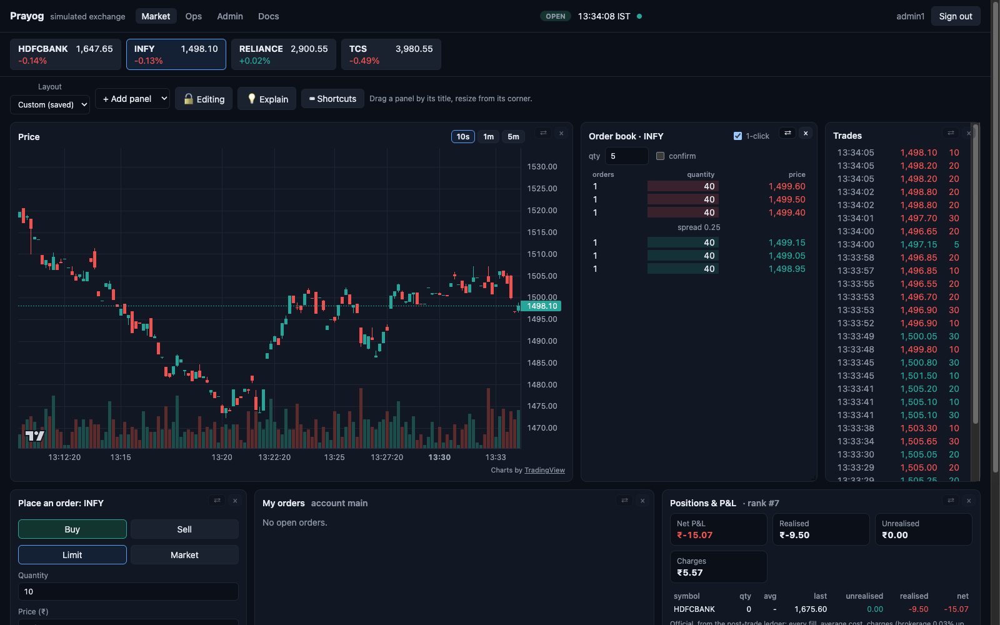
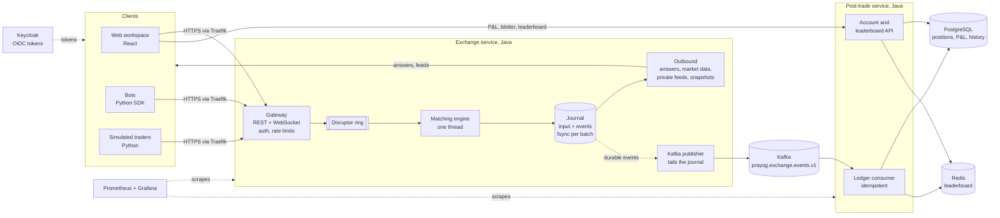

# Prayog

A simulated stock exchange and bot arena: simulated traders create the market; people trade by hand or with bots.

It runs on one machine with `make up`:
- a single-threaded matching engine on an LMAX Disruptor, with a journal, deterministic replay and snapshots;
- simulated traders (a market maker, noise and momentum traders);
- a trading workspace in the browser;
- a Python bot SDK;
- a Kafka event stream into a post-trade ledger with P&L and a leaderboard;
- an ops page to run a whole simulated day, and Grafana dashboards.



Progress: [docs/PROGRESS.md](docs/PROGRESS.md). Docs site: https://rj8228.github.io/prayog/

- **Visit and trade:** [docs/guides/using-the-market.md](docs/guides/using-the-market.md)
- **Build a trading bot:** [docs/bots/](docs/bots/README.md)
- **Run, check and debug:** [docs/runbook/](docs/runbook/README.md); what breaks and how it recovers:
  [docs/failure-modes.md](docs/failure-modes.md)
- **Learn how it works:** [docs/learnings/](docs/learnings/README.md), the decisions in [docs/adr/](docs/adr/index.md),
  the numbers in [docs/benchmarks.md](docs/benchmarks.md); published at https://rj8228.github.io/prayog/
- **A 3-minute demo:** [docs/demo.md](docs/demo.md)

## Architecture



**The order path** (no network, no database): gateway → ring → matching (one writer thread, no locks) → journal
(group commit, fsync) → answer. Matching takes about 100 ns a command; end to end is set by fsync
([benchmarks](docs/benchmarks.md)).

**After the trade:**
- The Kafka publisher reads the fsynced journal on its own thread, so Kafka downtime never stops trading and loses
  no events.
- Post-trade applies trades by natural key in one transaction per batch, so redelivery changes nothing.
- The whole ledger is zero-sum, and the tests check it.

**Guarantees, each tested:**
- Replaying the journal gives a byte-identical event log, checked in CI and on the live journal.
- Restarts start from a verified snapshot.
- A rule change is a journaled command, so history replays under the rules it was made with.
- P&L reconciles exactly with the trade log.

## In numbers

Measured on an Apple M1 laptop; every number has its command, machine and date in
[docs/benchmarks.md](docs/benchmarks.md).

| What | Number |
|---|---|
| Matching, one thread | about 60-120 ns per command |
| Order path with journal and fsync | 20,000 commands/s held; median about 12 ms (the SSD's fsync) |
| Order path without the disk | 0.5 µs median (busy-spin) |
| Live stack, steady state | p50 2.8 ms, p99 14 ms, p99.9 25 ms |
| Journal archiving | 2.6-4.8x smaller |
| Boxing-free order index | 12-21% less allocation per operation |

## Status

The MVP is complete: sessions S1-S22, the admin console, workspace and browser strategies, duplicate client order
IDs, snapshots, journal archiving and allocation work. 23 decisions are recorded in [docs/adr/](docs/adr/index.md),
and [docs/failure-modes.md](docs/failure-modes.md) maps each failure to the test that proves recovery.

Still open (details in [docs/PROGRESS.md](docs/PROGRESS.md)):
- volatility clustering in the simulated traders ([realism report](docs/realism.md));
- a recorded 2-minute demo video;
- UI component tests and Playwright journeys;
- public hosting;
- tagged releases, ending with the bot arena.

## Prerequisites

Java 21, Docker (Desktop with at least 4 GB of memory), [uv](https://docs.astral.sh/uv/), Node 22 with pnpm 10
(`corepack`).

## Quick start

```sh
make help   # list targets
make test   # build and test everything: Java (unit, property, Cucumber, Testcontainers), Python, web
```

## Local stack

```sh
make env    # once: creates .env with random local secrets (git-ignored)
make up     # builds and starts everything; add PROFILES="infra app obs" for Prometheus and Grafana
make smoke  # quick checks of every service
make e2e    # the live market is correct: feeds, liquidity, bots, Kafka outage, post-trade, journal replay
make down   # stops it (data is kept); `make reset` also deletes the data volumes
```

| Address | What |
|---|---|
| http://app.prayog.localhost | The live market: watch without signing in; sign in as `trader1` to trade, `ops1` for the ops page |
| http://api.prayog.localhost | The exchange and post-trade API for bots ([reference](docs/bots/api.md)) |
| http://auth.prayog.localhost | Keycloak; admin console at `/admin` (credentials in `.env`) |
| http://grafana.prayog.localhost | Dashboards (profile `obs`) |
| http://traefik.prayog.localhost/dashboard/ | Traefik routes |
| `localhost:5432`, `localhost:9094`, `localhost:6379` | PostgreSQL, Kafka, Redis for tools on your machine |

Browsers, curl and Python resolve `*.localhost` to your own machine. If a tool doesn't, add to `/etc/hosts`:

```
127.0.0.1 app.prayog.localhost api.prayog.localhost auth.prayog.localhost traefik.prayog.localhost grafana.prayog.localhost
```

Other targets: `make bench` and `make bench-latency` (performance), `make images` (amd64 and arm64 images),
`make ops-token` (a token for ops scripts).

The Keycloak realm and the database users are created only when their data volumes are empty. After changing
`deploy/compose/keycloak/prayog-realm.json`, `deploy/compose/postgres/init/` or the secrets in `.env`, run
`make reset`, or `make users` for roles, users and clients only.
